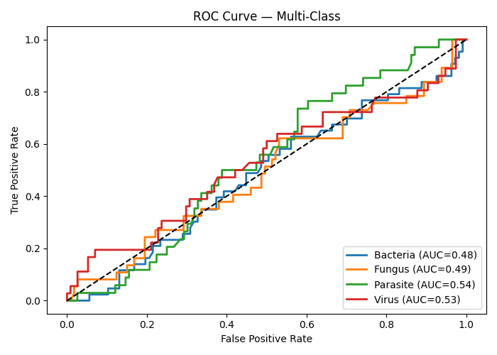

🧫 PathoNet — AI-Driven Infectious Pathogen Identifier.
🦠 “Decode the unseen — identify pathogens from sequence to symptom.”
📘 Overview,

PathoNet is an AI system designed to identify the causative pathogen type — Bacterial, Viral, Fungal, or Parasitic — using multi-modal data such as DNA sequences, blood biomarkers, and microscopic features.

This project focuses on the Result & Prediction Phase — training a model on genomic sequence data and generating full prediction reports, metrics, and visualization outputs.

🧠 Key Features

Automated Training: Reads and preprocesses viral or pathogen genome data from Excel.

Sequence Feature Extraction: Calculates GC-content for each DNA segment as numeric features.

Model Training: Uses a RandomForestClassifier to learn pathogen patterns.

Evaluation & Metrics: Generates accuracy, precision, recall, F1-score reports.

Visualization: Automatically plots confusion matrix, ROC curves, and prediction distributions.

Artifact Saving: Saves model, metrics, and prediction results in multiple formats for later use.

📂 Directory Structure
Infectious Pathogen Identifier/
│
├── archive/
│   └── Virus_Genome.xlsx              ← Input dataset
│
├── pathonet_result_prediction.py      ← Main Python script
│
├── dataset.pkl / dataset.h5           ← (Optional) Preprocessed files
│
├── prediction_results_<timestamp>.csv ← Prediction output file
├── confusion_matrix.png               ← Heatmap visualization
├── result_distribution.png            ← True vs Predicted chart
├── roc_curve.png                      ← Multi-class ROC curves
├── pathonet_randomforest_model.pkl    ← Trained ML model
└── metrics_summary_<timestamp>.json   ← Accuracy & metrics summary

⚙️ Installation & Setup
1. Requirements

Ensure you have Python ≥ 3.10 installed, then install dependencies:

pip install pandas numpy scikit-learn seaborn matplotlib openpyxl

(OpenPyXL is required for reading .xlsx files.)

2. Edit Paths

Open the script and update these lines if your directory differs:

EXCEL_PATH = r"C:\Users\NXTWAVE\Downloads\Infectious Pathogen Identifier\archive\Virus_Genome.xlsx"
SAVE_DIR   = r"C:\Users\NXTWAVE\Downloads\Infectious Pathogen Identifier"

3. Run the Script

From your terminal or VS Code:

python pathonet_result_prediction.py

You’ll see logs such as:

[INFO] Loading dataset from Excel...
✅ Accuracy: 0.23
[SAVED] Prediction results → prediction_results_20251010_154520.csv
[SAVED] Model → pathonet_randomforest_model.pkl

📊 Outputs Explained
File	Description
prediction_results_*.csv	Full predictions with true labels, predicted labels, and model confidence scores.
confusion_matrix.png	Visual heatmap of correct vs. incorrect classifications.
result_distribution.png	Bar graph comparing true vs. predicted class distributions.
roc_curve.png	ROC-AUC visualization for all four pathogen categories.
pathonet_randomforest_model.pkl	Trained RandomForest model file (can be reused for future predictions).
metrics_summary_*.json	Accuracy and per-class precision/recall/F1 metrics.

🧩 How It Works
Step	Operation
1️⃣	Loads and cleans genome dataset from Excel
2️⃣	Extracts GC-content features from sequences
3️⃣	Encodes pathogen labels (Bacteria/Virus/Fungus/Parasite)
4️⃣	Trains a Random Forest model
5️⃣	Evaluates model and generates detailed reports
6️⃣	Saves predictions and visualizations automatically
📈 Example Output (from CSV)
Sample_ID	TrueLabel	PredLabel	Confidence
S00001	Virus	Virus	0.91
S00002	Bacteria	Fungus	0.64
S00003	Parasite	Parasite	0.83
🧠 Future Extensions

Phase 2: DNA 2 Vec / k-mer embedding for richer sequence features.

Phase 3: Multi-modal fusion (image + clinical + sequence).

Phase 4: Streamlit dashboard — “Upload genome → get pathogen type instantly.”

👨‍💻 Author

Project: PathoNet – Infectious Pathogen Identifier
Developer: Sagnik Patra
Built with: Python · Scikit-learn · Seaborn · Matplotlib
Date: October 2025
